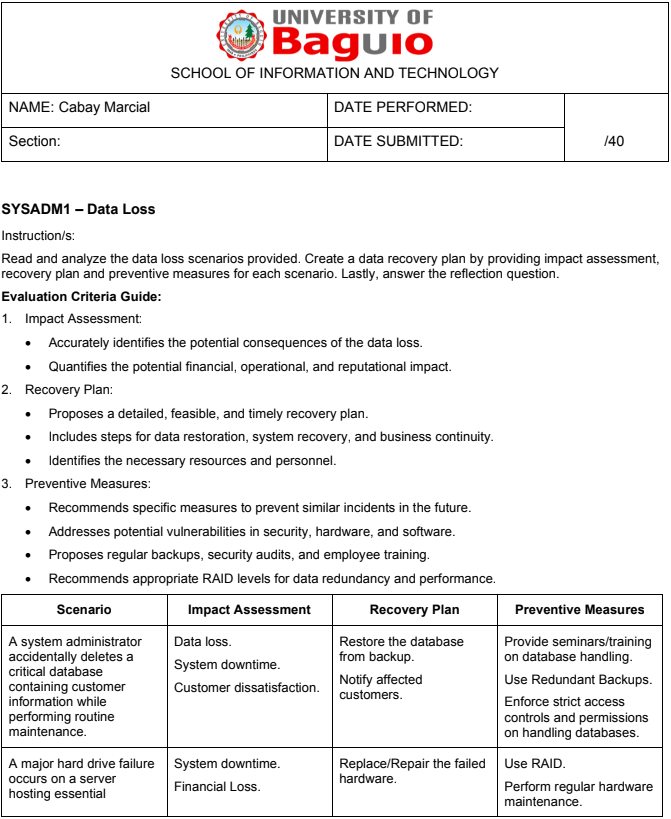
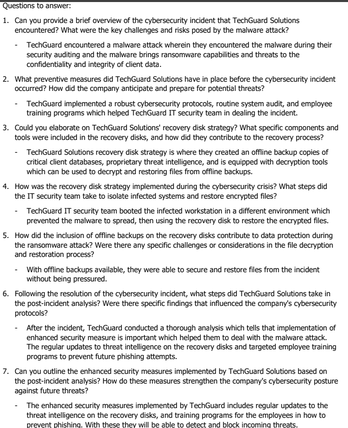

***

|   SCHOOL OF INFORMATION TECHNOLOGY |                           |   |
|-----------------------------------------------------------------------------------|---------------------------|---|
| NAME: Cabay Marcial B.                                                            |                           |   |
| SECTION: IDC1                                                                     | DATE SUBMITTED: 12/7/2024 |   |

# SYSADM1 PORTFOLIO

***

**Table of Contents**

***

| **Name of Activities**                                    | **Date** | **Score** | **Page No.** |
|-----------------------------------------------------------|----------|-----------|--------------|
| **First Grading**                                         |          |           |              |
| Quizzes                                                   |          |           |              |
| [Quiz](#q)                                                | 09/27/24 |           | 5            |
| Other Activities                                          |          |           |              |
| [Seatwork (Case Study)](#sw1_fe)                          | 08/20/24 | 44/50     | 3            |
| [Activity/Exercise (Organizational Policies)](#la_op)     | 08/27/24 | 5/        | 4            |
| [Laboratory Work (Managing Services in Windows)](#lw_msw) |          |           | 5            |
| [First Grading Exam](#fge)                                |          |           | 7            |
| **Midterms**                                              |          |           |              |
| Other Activities                                          |          |           |              |
| [Lecture Activity: EULA](#eula)                           |          |           | 8            |
| [Laboratory Work: Managing Services in Linux](#lw_msl)    |          |           | 9            |
| [Web Server Monitoring](#r1)                              |          |           | 11           |
| [Laboratory Work: Print Services](#lw_ps)                 |          |           | 12           |
| [Laboratory Work: Setting up Web Server](#lw_sw)          |          |           | 14           |
| [Midterm Exam](#me)                                       |          |           | 16           |
| **Finals**                                                |          |           |              |
| Quizzes                                                   |          |           |              |
| [Quiz 1 (Recovery)](#q1_r)                                |          |           | 17           |
| Other Activities                                          |          |           |              |
| [Laboratory Work 1 (Kerberos)](#lw_k)                     |          |           | 18           |
| [Seatwork 1 (Data Loss)](#sw1_dl)                         |          |           | 20           |
| [Laboratory Work 2 (Git)](#lw_git)                        |          |           | 23           |
| [Capacity Planning](#ga_cp)                               |          |           | 25           |
| Final Exam                                                |          |           |              |
| [Course Reflection](#cf)                                  |          |           | 28           |

**First Grading**

**Seatwork 1:**

**Lecture Activity: Organizational Policies**

**Quiz**

**Laboratory Work 3: Managing Services in Windows**

**First Grading Exam:**

**Midterms**

**Lecture Activity: EULA**

**Laboratory Work: Managing Services in Linux**

**Research 1: Web Server Monitoring**

**Laboratory Work: Print Services**

**Laboratory Work: Setting up Web Server**

**Midterm Exam:**

****

**Finals**

**Laboratory Work: Kerberos**

**Seatwork 1: Data Loss**

**Quiz 1: Recovery**

**Laboratory Work: Git**

**Group Activity: Capacity Planning**

**Course Reflection**

What were your initial expectations for the course? Did the course meet, exceed, or fall short of these expectations?

| I expected the course to help me gain more understanding about computer systems specially as operating systems and troubleshooting systems. I hoped to learn more about managing systems or servers and hands-on experience, and though it meets my expectations to some extent, I’d place it somewhere in the middle.  |
|-------------------------------------------------------------------------------------------------------------------------------------------------------------------------------------------------------------------------------------------------------------------------------------------------------------------------|

What were the main topics or concepts covered in the course? How did these topics contribute to your understanding of the subject matter?

| The topics that were covered throughout the course includes installing Linux, managing services in Windows and Linux. Explored Infrastructure services, End-user License Agreement, LDAP, Git, and Kerberos. Also, about the importance of backup strategies and more on storage. |
|-----------------------------------------------------------------------------------------------------------------------------------------------------------------------------------------------------------------------------------------------------------------------------------|

Reflecting on your learning process, what were the most effective strategies or techniques that helped you grasp and retain the course material?

| To retain my learnings, did some notes, and practicing on virtual machines. |
|-----------------------------------------------------------------------------|

Were there any particular assignments, projects, or activities that significantly enhanced your learning experience? Why were they effective?

| Doing all the laboratory works such as managing services and deploying services such as the web and printer. |
|--------------------------------------------------------------------------------------------------------------|

Did you encounter any challenges or difficulties during the course? How did you overcome these obstacles, and what did you learn from them?

| Challenges I encountered throughout the course was my tendency to neglect my responsibilities to stay consistent with my learning. Maybe due to distractions and not managing my time well or is that I’m losing interest. |
|----------------------------------------------------------------------------------------------------------------------------------------------------------------------------------------------------------------------------|

Did the course encourage critical thinking and analysis? How did it promote higher-order thinking skills, such as problem-solving or decision-making?

| Yes, like doing some activities that involves case studies and with these activities, it helped to improve my thinking and analysis. |
|--------------------------------------------------------------------------------------------------------------------------------------|

Reflecting on your personal growth, what new knowledge, skills, or perspectives did you gain from this course?

| Gained an understanding about what system administration is. |
|--------------------------------------------------------------|

How do you plan to apply what you have learned in this course to your future studies, career, or personal life?

| By using this knowledge to solve real-world problems and maybe to share it to my friends or classmates. |
|---------------------------------------------------------------------------------------------------------|

***
